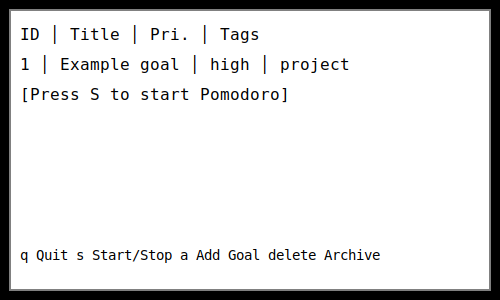

Text User Interface
===================

Goal Glide includes a lightweight TUI built with Textual. Start it from the
command line::

   python -m goal_glide tui

Navigation and key bindings
---------------------------

``up/down``
    Move the selection between goals.

``left/right``
    Collapse or expand a goal branch.

``a``
    Add a new goal.

``delete``
    Archive the selected goal.

``s``
    Start or stop a pomodoro timer for the highlighted goal.

``t``
    Jot a quick thought linked to the goal.

``e``
    Edit the selected goal.

``q``
    Quit the interface.

Workflow example
----------------

::

   + Goals
   |-- Write blog post
   |   |-- Research topic
   |-- Exercise daily

Use the arrow keys to move through the tree of goals. Press ``s`` to start
tracking a pomodoro for the highlighted goal. While the timer is running a
progress bar and remaining time appear in the details panel.

Troubleshooting
---------------

- Ensure your terminal supports UTF-8 and ANSI colours.
- Run ``poetry install`` if the TUI fails to launch due to missing
  dependencies.
- Verify ``GOAL_GLIDE_DB_DIR`` points to a writable directory when storage
  errors occur.
